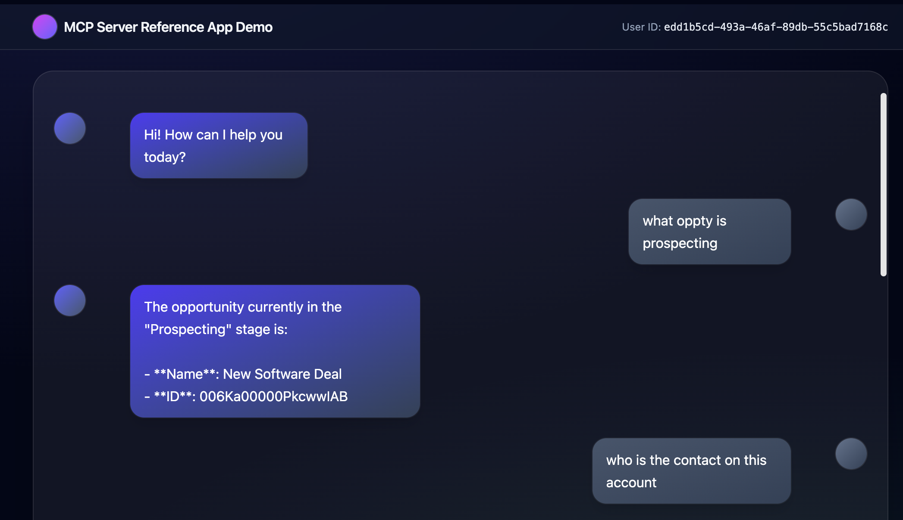
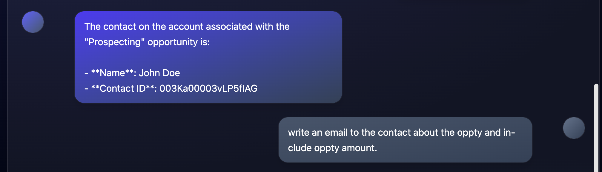
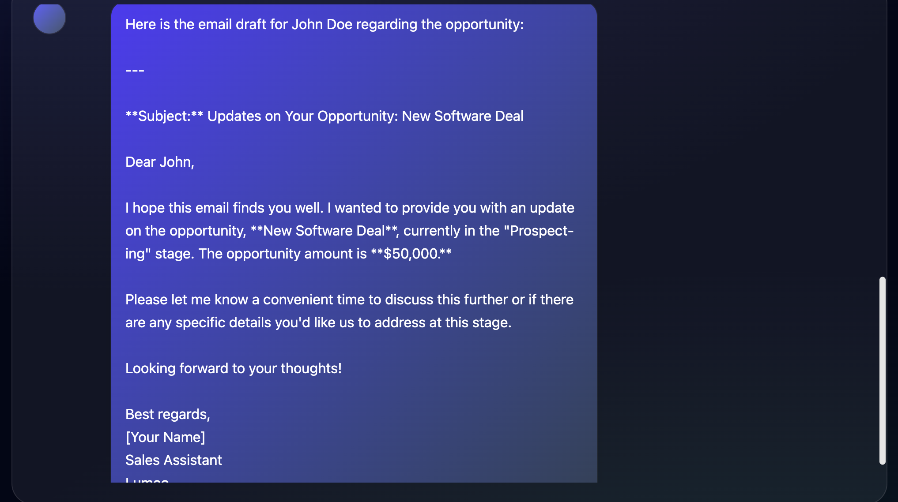
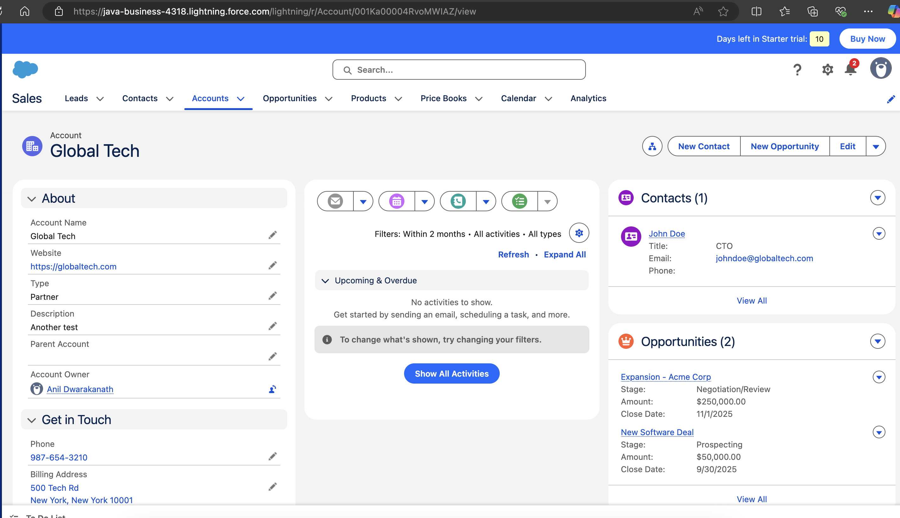

### Salesforce MCP Server Reference App

This repository contains a reference implementation of a server that interacts with Salesforce's API and exposes the API using Model Context Protocol(MCP). It provides a FastAPI-based backend to handle user queries, manage sessions.

### Prerequisites

- Python 3.11+.
- Azure Foundry Resource with Azure OpenAI Model deployment. 
- Salesforce Account with API access.
- Bash Terminal.
- Az CLI installed and configured.
- Azure Login configured with `az login`.
- Azure Login credential should have Azure AI Developer role assigned in Azure AI Foundry as shown below.


### Setup Instructions

1. **Clone the Repository**:
   ```bash
   git clone <repository-url>
   cd sales_force_ai_agent_service
   chmod +x run1.sh
   ```

2. **Azure Login**
   ```bash
   az login
   ```

3. **Navigate to the Project Directory**:
   ```bash
   cd sales_force_ai_agent_service/backend/sf_mcp_server
   ```
   Update the .env file with your Salesforce credentials.

4. **Navigate to the Project Directory**:
   ```bash
   cd sales_force_ai_agent_service/backend/agent_api_server
   ```
   Update the .env file with your Azure OpenAI and Foundry credentials.

5. **Run Install Script**:
   ```bash
   cd sales_force_ai_agent_service
   bash run1.sh
   ```


### Troubleshooting

- Node error:
   ```bash
   brew update
   brew reinstall node
   ```

### Demo Screen Shots






Salesforce Demo Account:
