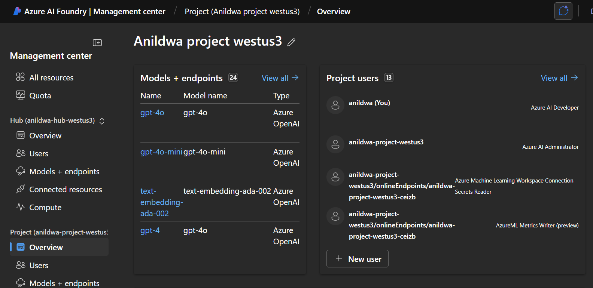

### Salesforce MCP Server Reference App

This repository contains a reference implementation of a server that interacts with Salesforce's API and exposes the API using Model Context Protocol(MCP). It provides a FastAPI-based backend to handle user queries, manage sessions.

### Prerequisites

- Python 3.11+.
- Azure Foundry Resource with Azure OpenAI Model deployment. 
- Salesforce Account with API access.
- Bash Terminal.
- Az CLI installed and configured.
- Azure Login configured with `az login`.
- Azure Login credential should have Azure AI Developer role assigned in Azure AI Foundry as shown below.


### Setup Instructions

1. **Clone the Repository**:
   ```bash
   git clone